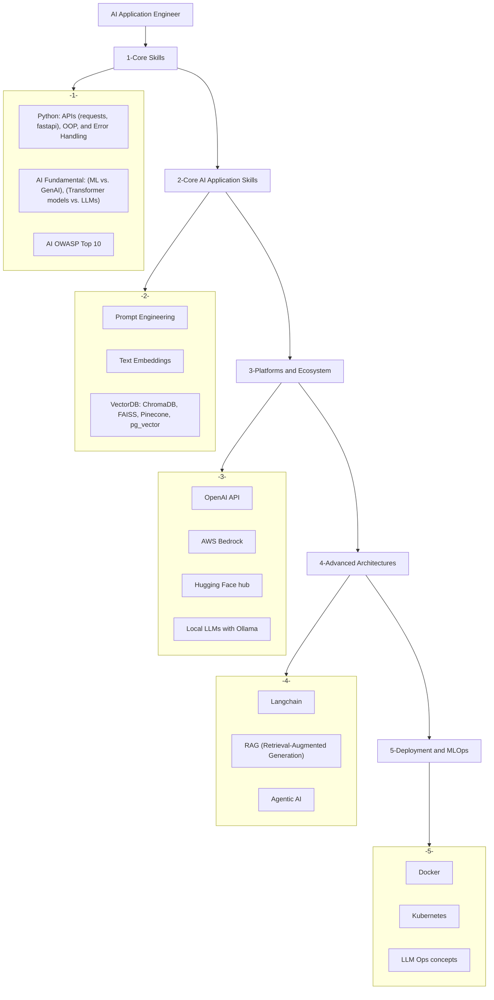

## Generative AI Application Engineer Roadmap

```mermaid
graph TD
    START["AI Application Engineer"]
    START --> S1["1-Core Skills"] --> S1_Children 
    S1 --> S2["2-Core AI Application Skills"] --> S2_Children
    S2 --> S3["3-Platforms and Ecosystem"]   --> S3_Children
    S3 --> S4["4-Advanced Architectures"] --> S4_Children
    S4 --> S5["5-Deployment and MLOps"] --> S5_Children
    
    subgraph S1_Children["-1-"]
        direction LR
        Python["Python: APIs (requests, fastapi), OOP, and Error Handling"]
        AI["AI Fundamental: (ML vs. GenAI), (Transformer models vs. LLMs)"]
        OWASP["AI OWASP Top 10"]
    end
    
    subgraph S2_Children["-2-"]
        direction LR
        Prompt["Prompt Engineering"]
        Embeddings["Text Embeddings"]
        VectorDB["VectorDB: ChromaDB, FAISS, Pinecone, pg_vector"]
    end
    
    subgraph S3_Children["-3-"]
        direction LR
        OpenAI["OpenAI API"]
        Bedrock["AWS Bedrock"]
        HF["Hugging Face hub"]
        Ollama["Local LLMs with Ollama"]
    end
    
    subgraph S4_Children["-4-"]
        direction LR
        LC["Langchain"]
        RAG["RAG (Retrieval-Augmented Generation)"]
        Agent["Agentic AI"]
    end
    
    subgraph S5_Children["-5-"]
        direction LR
        Docker["Docker"]
        Kubernetes["Kubernetes"]
        MLOps["LLM Ops concepts"]
    end
```