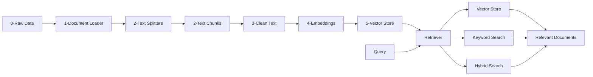
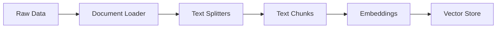
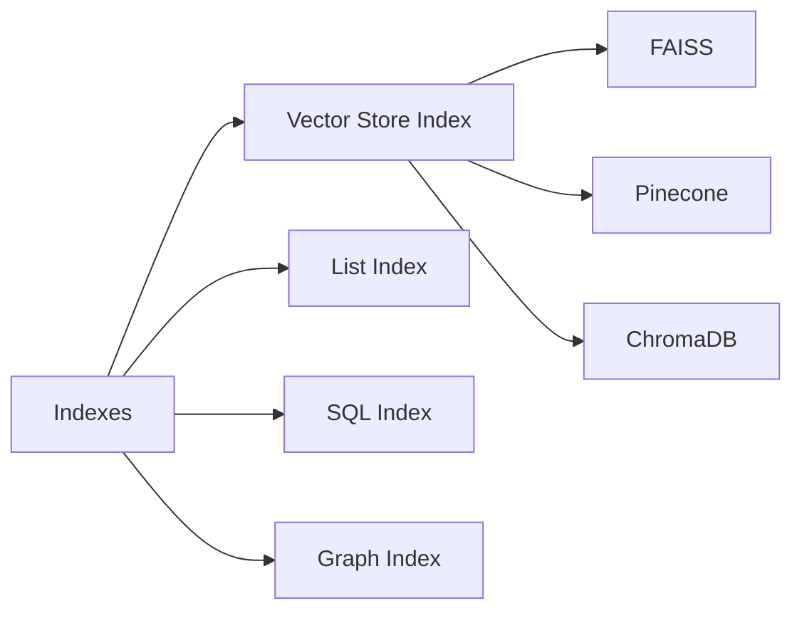
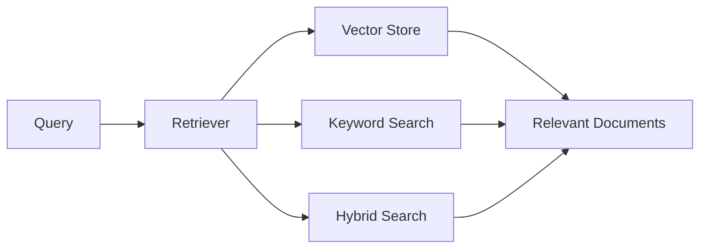

### Full Workflow:

### Components Details:
#### Data Preparation:
Loading, preprocessing and structuring.

#### Indexes:
Data structures that organize documents for efficient retrieval

#### Retrievers:
Finders of relevant documents based on query

